# Hello there!👋🏻

Nice to meet you, my name is Rafael Báguena Girbés.

Hope you find everything here useful, feel free to reach me at social media!

## About me

- Data engineer from València, Spain.
- Working in data & analytics solutions since 2010. 
- I love learning new things, pushing technology further, and collaborating on projects that inspire and add value at all levels.
- Passionate about technology, video games, comics, and memes alike.
- Microsoft Data Platform MVP since December 2025.

## GitHub stats

